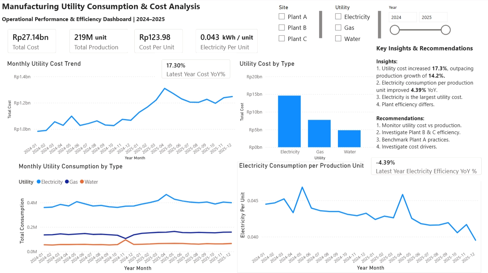

# Manufacturing Utility Cost & Efficiency Analysis

**Power BI | Excel | Power Query | DAX**

[View Dashboard](dashboard.png) | [View Power BI Report](powerbi/manufacturing_utility_analysis.pbix)

## Project Overview

This project analyzes manufacturing utility costs, consumption, production output, and electricity efficiency across three production plants from 2024–2025.

The objective is to identify utility cost trends, efficiency changes, and differences in plant performance that could support operational decision-making.

An interactive Power BI dashboard was developed using Power Query for data preparation and DAX for analytical calculations.

---

## Business Problem

Manufacturing operations need to balance production growth with utility costs and energy efficiency.

Higher production typically leads to higher utility consumption, but higher consumption does not necessarily indicate lower efficiency.

This analysis evaluates:

- Utility cost trends
- Production growth
- Electricity consumption
- Electricity efficiency
- Plant-level performance

---

## Business Questions

1. How did utility costs change compared with production from 2024 to 2025?
2. Which utility contributes the most to total utility costs?
3. How did electricity consumption change relative to production?
4. Did electricity consumption per production unit improve or worsen?
5. How does performance differ across Plant A, Plant B, and Plant C?
6. Which areas should management investigate further?

---

## Dataset

The dataset contains manufacturing utility and production data covering three plants across 2024–2025.

The data includes:

- Date
- Site / Plant
- Utility Type
- Utility Consumption
- Utility Cost
- Production Units

> **Note:** The dataset is synthetic data created for portfolio and learning purposes.

---

## Tools & Technologies

- **Microsoft Excel** — initial dataset
- **Power Query** — data preparation and transformation
- **Power BI** — dashboard development and visualization
- **DAX** — analytical calculations and KPI measures

---

## Data Preparation

Data preparation was performed using Power Query in Power BI.

The data was reviewed for duplicate records and prepared for analysis. A dedicated Date Table was also created to support time-based analysis and year-over-year comparisons.

---

## Data Model & DAX

DAX measures were created to calculate key performance indicators including:

- Total Cost
- Total Production
- Cost per Unit
- Electricity Consumption
- Electricity Consumption per Production Unit
- Year-over-Year Cost Change
- Year-over-Year Efficiency Change

---

## Dashboard

The Power BI dashboard provides an interactive view of manufacturing utility costs, production output, utility consumption, and electricity efficiency.

### Dashboard Features

- KPI cards for total cost, production, cost per unit, and electricity consumption per production unit
- Monthly utility cost trend
- Utility cost comparison by type
- Monthly utility consumption by type
- Electricity consumption per production unit
- Plant, utility, and year filters
- Key insights and recommendations

### Dashboard Preview

---

## Project Files

| File | Description |
|------|-------------|
| [Dashboard Preview](dashboard.png) | Final Power BI dashboard screenshot |
| [Power BI Report](powerbi/manufacturing_utility_analysis.pbix) | Power BI report file |
| [Dataset](data/utility_data.xlsx) | Synthetic dataset used for the analysis |

> The dataset is synthetic and was created for portfolio and learning purposes. It does not contain confidential company or personal information.

---

## Key Findings

### 1. Utility cost increased faster than production

Total utility cost increased by **17.3%** from 2024 to 2025, while total production increased by **14.2%**.

This indicates that utility cost growth outpaced production growth.

### 2. Electricity efficiency improved

Electricity consumption increased by **9.21%**, compared with **14.2% production growth**.

As a result, electricity consumption per production unit improved by **4.39% YoY**.

### 3. Electricity was the largest utility cost

Electricity represented the largest utility cost category, exceeding gas and water costs.

Electricity cost increased by **16.8%** from 2024 to 2025.

### 4. Plant-level efficiency performance differed

Electricity consumption per production unit changed differently across plants:

| Plant | Electricity Efficiency YoY |
|-------|-----------------------------|
| Plant A | **-1.01%** |
| Plant B | **+4.01%** |
| Plant C | **+4.25%** |

Plant A showed an improvement, while Plant B and Plant C experienced increases in electricity consumption per production unit.

---

## Recommendations

### 1. Monitor utility cost relative to production

Since utility costs increased faster than production, management should regularly monitor utility spending relative to production output.

### 2. Investigate Plant B and Plant C efficiency

Plant B and Plant C experienced increases in electricity consumption per production unit.

Further investigation should identify potential operational factors contributing to these increases.

### 3. Benchmark Plant A's practices

Plant A improved electricity consumption per production unit.

Its operational practices could be reviewed to identify practices that may be applicable to other plants.

### 4. Investigate electricity cost drivers

Electricity was the largest utility cost category.

Additional information such as utility pricing, production mix, operating hours, or equipment-level data could help identify the underlying cost drivers.

---

## Analysis Limitations

This analysis focuses on utility consumption, utility costs, and production output.

The dataset does not include detailed information such as:

- Utility pricing
- Equipment-level consumption
- Operating hours
- Production mix
- Downtime

Therefore, the analysis identifies areas for further investigation but does not establish the root causes of cost changes.

---

## Conclusion

This project demonstrates how Power BI can be used to transform manufacturing utility and production data into actionable business insights.

The analysis identified differences between production growth, utility cost growth, and electricity efficiency, while also highlighting variations in plant-level performance.

The findings provide a starting point for further investigation into utility cost drivers and operational efficiency.

---

## What I Learned

Through this project, I developed practical experience in:

- Preparing data using Power Query
- Building data models in Power BI
- Creating DAX measures
- Designing interactive dashboards
- Validating calculations and filter context
- Interpreting analytical results
- Translating findings into business insights and recommendations

